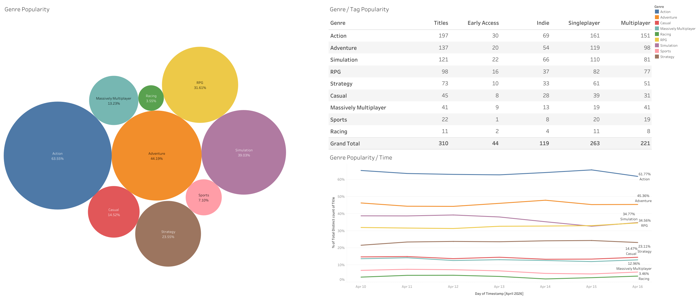
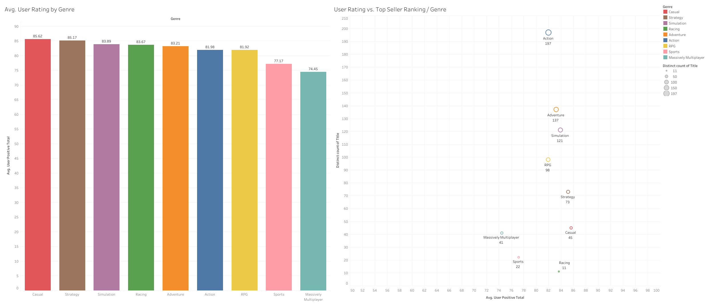

# 🎮 Steam Game Insights: Market Trends & Performance Analysis
This project explores the Steam marketplace using web-scraped game data to uncover patterns in **genre distribution, pricing strategies, and performance dynamics** across different stages of a game's lifecycle.

The project combines **Python-based data scraping and cleaning** with **exploratory data analysis in Jupyter Notebooks**, and includes **interactive visualizations built in Tableau**.

## 🔍 Research Objectives

This project investigates several key questions:

- X
- Y

## ⚙️ Project Structure
```
steam-data-project/
│
├── data/
│ ├── raw/ # Raw scraped CSV files (git-ignored)
│ ├── processed/ # Cleaned CSVs formatted for Tableau (git-ignored)
│ └── db/ # SQLite database (git-ignored)
│
├── notebooks/
│ └── analysis.ipynb # Exploratory analysis & statistical modeling
│
├── scripts/
│ ├── steam_scrape.py # Scrapes Steam game data
│ ├── build_csv.py # Transforms data for analysis & Tableau
│ └── sqlite_csv.py # Syncs CSV changes back to database
│
├── tableau/ # Tableau dashboards
│
├── .gitignore
├── requirements.txt
└── README.md
```

## ⚙️ Data Pipeline
Data was collected by scraping Steam game listings using Python. The scraping process gathered information such as:

- Game title  
- Price  
- Tags / genres  
- Game type (e.g., free-to-play, paid)  
- Additional metadata where available

Multiple daily CSV files were generated during scraping and later combined into a unified dataset for analysis.

The processed dataset explodes the genres column into individual rows, one per genre per game, to enable genre-level filtering and aggregation in Tableau.
```
# Step 1 - Scrapes Steam game data, appends it to the SQLite database, and outputs a raw daily CSV
python scripts/steam_scrape.py

# Step 2 - Builds the processed CSVs from the SQLite database for use in Tableau
python scripts/build_csv.py
```
## 🧰 Tools & Technologies

- Python (Pandas, BeautifulSoup)
- SQLite
- Jupyter Notebook
- Tableau Public
- Git & GitHub

## 📦 Data Outputs

| File                                 | Description |
|--------------------------------------|-------------|
| `data/raw/steam_games_YYYYMMDDD.csv` | Raw daily scrape outputs, each file contains Steam game data collected on a specific date |
| `data/processed/steam_tableau.csv`   | Cleaned dataset formatted for Tableau, with genres split into individual rows for easier aggregation and filtering |
| `data/db/steam_master.db`            | SQLite database storing the full aggregated dataset, combining multiple daily scrapes into a structured, queryable format |

## 📊 Key Findings

### 🎯 Genre Dominance

Action and Adventure games dominate the marketplace, with **over 60% of games classified as Action**. These genres form the core of Steam’s ecosystem.



Indie developers are disproportionately concentrated in:
- Adventure  
- Simulation  
- Strategy  
- Casual  

In contrast, **MMOs are underrepresented among indie games**, likely due to higher development and maintenance costs.

### 📈 Which Genres Tend to Rank Higher?

To compare genre performance, I calculated how each genre’s **average ranking** differs from the overall average ranking across all games.

- Positive values → the genre tends to rank **higher (closer to #1)** than average  
- Negative values → the genre tends to rank **lower** than average  

In other words, this measures whether certain genres are **systematically more likely to appear near the top of the rankings**.

**Top Sellers**
- Massively Multiplayer (+15.24), Sports (+7.37), Action (+5.87) outperform  
- Casual (−11.63), Strategy (−7.84), Racing (−9.33) underperform

**New Releases**
- Strategy (+4.48), Simulation (+3.63) outperform  
- Massively Multiplayer (−18.48), Racing (−16.46), Sports (−13.77) underperform

### ⭐ Rankings vs. User Ratings

Less popular genres—**Racing, Casual, Strategy, Simulation**—often have **higher positive rating percentages**, suggesting stronger niche loyalty.

**MMO and Sports** show lower satisfaction despite strong ranking performance.



### 📉 Correlation: Rank vs. Total Ratings

I ran a Pearson correlation on the Top 200 subset to see if a higher rank (approaching #1) correlates with a higher number of total positive reviews.

**Top Sellers**
- Correlation (r): 0.061  
- P-value: 0.112  

**Popular New Releases**
- Correlation (r): 0.026  
- P-value: 0.702  

**Insight:** No meaningful relationship between ranking position and total positive ratings.

### 🔄 Lifecycle Comparison (Interaction Models)

This analysis asks:

> **Do the factors that drive success differ between newly released games and established top sellers on Steam?**

More specifically:
- Does **price** influence performance differently at launch vs. later stages?
- Do **user rating percentages** matter more once a game is established?
- Are there **genre-specific differences** in how these factors affect rankings?

### Methodology

To test this, I estimated **separate OLS regression models** for:

- **Top Sellers** (late-stage / sustained performance)
- **Popular New Releases** (early-stage performance)

#### Dependent Variable
- `1 / rank_position` (inverse rank)
  - Higher values indicate better performance (closer to rank #1)

#### Independent Variables
- Price  
- Percentage of positive user ratings  
- Game attributes (e.g., genre, indie status, multiplayer, early access)

#### Interaction Terms
To capture differences across genres, interaction terms were included:
- Genre × Price  
- Genre × Rating Percentage  

This allows the effect of price and ratings to vary depending on the type of game.

Although some predictors (price and rating percentage) are statistically significant in certain models, their **practical impact is minimal**.

Across all models:
- R² values remain very low (0.005–0.049)
- Coefficient magnitudes are extremely small

This indicates that:
> **Ranking outcomes on Steam are largely not explained by price or rating percentage alone.**

#### Top Sellers
- R² = 0.030  
- User ratings: β = 0.0003 (p = 0.015)  
- Price: β = 0.0003 (p = 0.001)  
- RPG × Price: β = -0.0004 (p = 0.009)  
- Early access: β = 0.0180 (p < 0.001)  
- Indie: β = -0.0075 (p < 0.001)  
- Singleplayer: β = -0.0082 (p = 0.006)  

#### New Releases
- R² = 0.049  
- Price: β = -0.0007 (p = 0.019)  
- Strategy × Price: β = -0.0018 (p = 0.003)  
- Free-to-play: β = 0.0918 (p < 0.001)  
- Multiplayer: β = -0.0157 (p = 0.008)  

## 📊 Tableau Dashboard

[View interactive dashboard on Tableau Public](https://public.tableau.com/views/TopSellingGamesonSteam/GenreTagPopularityDashboard?:language=en-US&:sid=&:redirect=auth&:display_count=n&:origin=viz_share_link)

## 🚀 Future Improvements

- Add time-series analysis across multiple dates  
- Incorporate review sentiment analysis  
- Build predictive models for game success  
- Expand features (developer, publisher, release timing)